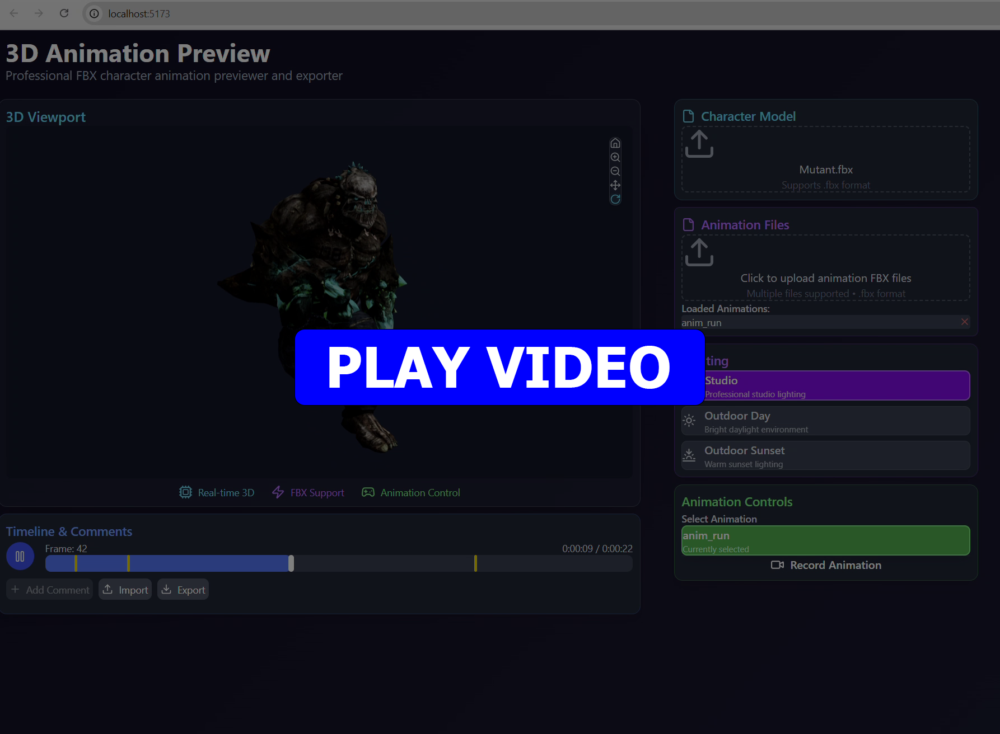
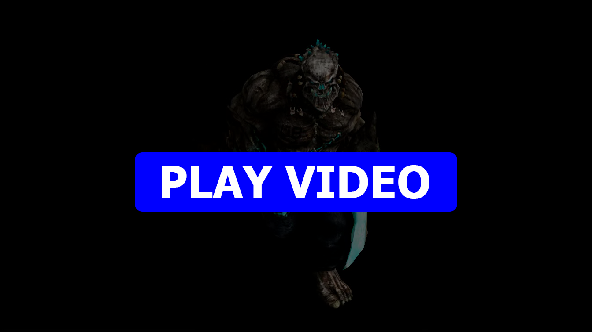

# 3D Animation Preview & Feedback Tool

This is a sample project I created that anyone can use to preview a FBX 3D model, preview animations and add any design feedback right in the timeline.

## Features

* Import FBX model & animations.
* Preview lighting conditions/materials.
* Add notes/comments in the timeline.
* Import/export timeline comments.
* Record a video of the current playback.

## Technologies Used

* ThreeJS for 3D Viewport and FBX
* Node/React/TailwindCSS for UI/App

## Demos

| App Demo                                                                | Viewport Render                                                                                                    |
| ------------------------------------------------------------------------| ------------------------------------------------------------------------------------------------------------------ |
[](public/sample/Demo.mp4)  | [](public/sample/animation_1748111403873.webm) |

## Dev

```
git clone <this_repo>
cd 3D_Animation_Preview
npm install
npm run dev
```

* Go to http://localhost:5173